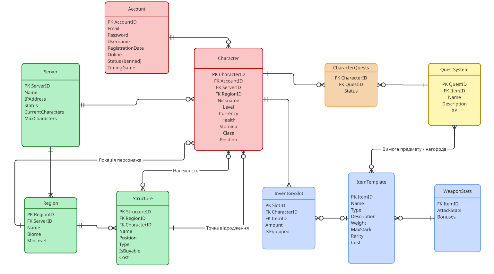

# Лабораторна робота №1

<strong>Група:</strong> ІО-42

<strong>Виконали:</strong> Раханова К. М.,
Духота В. О.,
Товстоп'ят О. О.

<strong>Перевірив:</strong> Русінов В. В.

# Тема:
Збір вимог та розробка схеми ER

# Мета:
створити документ з вимогами, який окреслює, які дані слід зберігати (сутності та атрибути) та їхні зв'язки. Виходячи з цих вимог, визначити ключові сутності та намалювати ER-діаграму – графічний план моделі даних.

Для виконання завдання ми обрали створити базу даних для RPG-гри.

## Короткий виклад вимог

Інформаційна система призначена для зберігання та управління даними багатокористувацької онлайн RPG-гри. Система повинна забезпечувати облік користувацьких акаунтів, керування персонажами, підтримку серверноїї структури, реалізацію квествої системи, інвентаря та ігрових предметів.

### Потреби зацікавлених сторін:

- **Гравець:** він потребує можливолсті реєстрації акаунта, створення та розвитку персонажів, участі у квестах, отримання нагород, керування інвентарем та взаємодії з ігровим світом. Для гравця важливо забезпечити стабільність роботи системи, збереження прогресу та коректне відображення характеристик персонажа.
- **Адміністратор системи:** він зацікавлений у можливості керування серверами, контролю статусу акаунтів, моніторингу активності гравців. Йому необхідні засоби для блокування порушників, контролю навантаження та управління ігровими ресурсами.
- **Власник:** зацікавлений у наявності достовірних даних для аналізу активності користувачів, популярності серверів та ефективності ігрової економіки, що дозволяє приймати стратегічні рішення щодо розвитку проєкту.

**Дані для зберігання будуть наступними:** інформація про користувачів, персонажів, сервери та регіони.

## Діаграма ER
матиме наступний вигляд:

   
  <i>Рисунок 1 – ER-діаграма бази даних RPG-гри</i>

## Список сутностей та їх атрибути
### Таблиця 1 - Clients
| Поле | Тип | Ключ | Опис |
|------|------|------|------|
| account_id | INT | PK | Ідентифікатор акаунта |
| email | VARCHAR |  | Ім’я  |
| password | VARCHAR |  | Телефон |
| username | INT |  | Бонусні бали |
| registration_date | INT |  | Бонусні бали |
| online | INT |  | Бонусні бали |
| status(banned) | INT |  | Бонусні бали |
| timing_game | INT |  | Бонусні бали |

### Таблиця 2 - Character

| Поле | Тип | Ключ | Опис |
|------|------|------|------|
| character_id | INT | PK | Ідентифікатор працівника |
| account_id | FK |  | ПІБ |
| server_id | FK |  | Посада |
| region_id | FK |  | Дата прийому на роботу |
| nickname | DATE |  | Дата прийому на роботу |
| level | DATE |  | Дата прийому на роботу |
| currency | DATE |  | Дата прийому на роботу |
| health | DATE |  | Дата прийому на роботу |
| stamina | DATE |  | Дата прийому на роботу |
| class | DATE |  | Дата прийому на роботу |
| position | DATE |  | Дата прийому на роботу |

### Таблиця 3 - Server
| Поле | Тип | Ключ | Опис |
|------|------|------|------|
| server_id | INT | PK | Ідентифікатор постачальника |
| name | VARCHAR |  | Назва компанії |
| ip_address | VARCHAR |  | Контактний телефон |
| status | VARCHAR | | Контактна електронна пошта |
| current_characters | VARCHAR | | Контактна електронна пошта |
| max_characters | VARCHAR | | Контактна електронна пошта |

### Таблиця 4 - Region

| Поле | Тип | Ключ | Опис |
|------|------|------|------|
| region_id | INT | PK | Ідентифікатор замовлення |
| server_id | INT | FK | Посилання на Clients |
| name | INT | FK | Посилання на Employees |
| biome | DATETIME |  | Дата створення |
| min_level | DECIMAL |  | Загальна сума |

### Таблиця 5 - Structure

| Поле | Тип | Ключ | Опис |
|------|------|------|------|
| structure_id | INT | PK | Ідентифікатор позиції меню |
| region_id | FK |  | Назва страви |
| character_id | FK |  | Ціна |
| name | VARCHAR |  | Категорія |
| position | VARCHAR |  | Категорія |
| type | VARCHAR |  | Категорія |
| is_buyable | VARCHAR |  | Категорія |
| cost | VARCHAR |  | Категорія |

### Таблиця 6 - CharacterQuests

| Поле | Тип | Ключ | Опис |
|------|------|------|------|
| character_id | INT | FK | Ідентифікатор інгредієнта |
| quest_id | FK |  | Назва |
| status | VARCHAR |  | Одиниця виміру |

### Таблиця 7 - QuestSystem

| Поле | Тип | Ключ | Опис |
|------|------|------|------|
| quest_id | INT | PK | Ідентифікатор поставки |
| item_id | INT | FK | Посилання на Suppliers |
| name | INT | FK | Хто прийняв поставку |
| description | DATE |  | Дата поставки |
| XP | DECIMAL | | Загальна вартість |

### Таблиця 8 - InventorySlot

| Поле | Тип | Ключ | Опис |
|------|------|------|------|
| slot_id | INT | PK | Ідентифікатор запису |
| character_id | INT | FK | Посилання на Orders |
| item_id | INT | FK | Посилання на Menu |
| amount | INT |  | Кількість |
| is_equipped | INT |  | Кількість |

### Таблиця 9 - ItemTemplate

| Поле | Тип | Ключ | Опис |
|------|------|------|------|
| item_id | INT | PK | Ідентифікатор рецепту |
| name | INT | FK | Посилання на Menu |
| type | INT | FK | Посилання на Ingredients |
| description | DECIMAL |  | Кількість інгредієнта |
| weight | DECIMAL |  | Кількість інгредієнта |
| max_stack | DECIMAL |  | Кількість інгредієнта |
| rarity | DECIMAL |  | Кількість інгредієнта |
| cost | DECIMAL |  | Кількість інгредієнта |

### Таблиця 10 - WeaponStas

| Поле | Тип | Ключ | Опис |
|------|------|------|------|
| item_id | INT | FK | Ідентифікатор запису |
| attack_stats | INT | FK | Посилання на Ingredients |
| bonuses | DECIMAL |  | Кількість на складі |

**PK** – первинний ключ, **FK** – зовнішній ключ.
