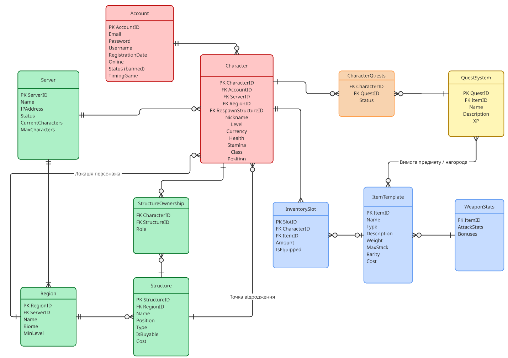

# Лабораторна робота №1

<strong>Група:</strong> ІО-42

<strong>Виконали:</strong> Раханова К. М.,
Духота В. О.,
Товстоп'ят О. О.

<strong>Перевірив:</strong> Русінов В. В.

# Тема:
Збір вимог та розробка схеми ER

# Мета:
створити документ з вимогами, який окреслює, які дані слід зберігати (сутності та атрибути) та їхні зв'язки. Виходячи з цих вимог, визначити ключові сутності та намалювати ER-діаграму – графічний план моделі даних.

Для виконання завдання ми обрали створити базу даних для RPG-гри.

## Короткий виклад вимог

Інформаційна система призначена для зберігання та управління даними багатокористувацької онлайн RPG-гри. Система повинна забезпечувати облік користувацьких акаунтів, керування персонажами, підтримку серверноїї структури, реалізацію квествої системи, інвентаря та ігрових предметів.

### Потреби зацікавлених сторін:

- **Гравець:** він потребує можливолсті реєстрації акаунта, створення та розвитку персонажів, участі у квестах, отримання нагород, керування інвентарем та взаємодії з ігровим світом. Для гравця важливо забезпечити стабільність роботи системи, збереження прогресу та коректне відображення характеристик персонажа.
- **Адміністратор системи:** він зацікавлений у можливості керування серверами, контролю статусу акаунтів, моніторингу активності гравців. Йому необхідні засоби для блокування порушників, контролю навантаження та управління ігровими ресурсами.
- **Власник:** зацікавлений у наявності достовірних даних для аналізу активності користувачів, популярності серверів та ефективності ігрової економіки, що дозволяє приймати стратегічні рішення щодо розвитку проєкту.

**Дані для зберігання будуть наступними:** інформація про користувачів, персонажів, сервери та регіони.

## Діаграма ER
матиме наступний вигляд:

   
  <i>Рисунок 1 – ER-діаграма бази даних RPG-гри</i>

## Список сутностей та їх атрибути
### Таблиця 1 - Account

| Поле | Тип | Ключ | Опис |
|------|------|------|------|
| account_id | INT | PK | Унікальний індентифікатор акаунта |
| email | VARCHAR |  | Електронна пошта  |
| password | VARCHAR |  | Пароль акаунта |
| username | VARCHAR |  | Ім'я користувача |
| registration_date | VARCHAR |  | Дата реєстрації |
| online | VARCHAR |  | Онлайн |
| status(banned) | VARCHAR |  | Статус(заблокований) |
| timing_game | INT |  | Час в грі |

### Таблиця 2 - Character

| Поле | Тип | Ключ | Опис |
|------|------|------|------|
| character_id | INT | PK | Унікальний ідентифікатор персонажа |
| account_id | INT | FK | Посилання на акаунт власника |
| server_id | INT | FK | Посилання на сервер |
| region_id | INT | FK | Посилання на поточний регіон |
| nickname | INT |  | Посилання на точку відродження |
| level | VARCHAR |  | Ігрове ім'я персонажа |
| currency | INT |  | Поточний рівень персонажа |
| health | INT |  | Кількість ігрової валюти |
| stamina | INT |  | Поточний рівень витривалості |
| class | VARCHAR |  | Ігровий клас (маг, воїн тощо) |
| position | VARCHAR |  | Поточні координати у світі (X, Y, Z) |

### Таблиця 3 - Server
| Поле | Тип | Ключ | Опис |
|------|------|------|------|
| server_id | INT | PK | Унікальний ідентифікатор сервера |
| name | VARCHAR |  | Назва сервера |
| ip_address | VARCHAR |  | IP-адреса для підключення |
| status | VARCHAR |  | Поточний стан (Online, Offline) |
| current_characters | INT |  | Поточна кількість гравців онлайн |
| max_characters | INT |  | Максимальна місткість сервера |

### Таблиця 4 - Region

| Поле | Тип | Ключ | Опис |
|------|------|------|------|
| region_id | INT | PK | Унікальний ідентифікатор регіону |
| server_id | INT | FK | Посилання на сервер |
| name | VARCHAR |  | Назва регіону |
| biome | VARCHAR |  | Тип біому (ліс, пустеля, гори) |
| min_level | INT |  | Рекомендований рівень для входу |

### Таблиця 5 - Structure

| Поле | Тип | Ключ | Опис |
|------|------|------|------|
| structure_id | INT | PK | Унікальний ідентифікатор споруди |
| region_id | INT | FK | Посилання на регіон |
| name | VARCHAR |  | Назва споруди |
| position | VARCHAR |  | Координати розміщення |
| type | VARCHAR |  | Тип споруди (дім, база, сейф-зона) |
| is_buyable | BOOLEAN |  | Чи доступна для покупки |
| cost | INT |  | Вартість споруди |

### Таблиця 6 - CharacterQuests

| Поле | Тип | Ключ | Опис |
|------|------|------|------|
| character_id | INT | PK, FK | Посилання на персонажа |
| quest_id | INT | PK, FK | Посилання на квест |
| status | VARCHAR | | Статус виконання (в процесі, завершено) |

### Таблиця 7 - QuestSystem

| Поле | Тип | Ключ | Опис |
|------|------|------|------|
| quest_id | INT | PK | Унікальний ідентифікатор квесту |
| item_id | INT | FK | Посилання на предмет-нагороду |
| name | VARCHAR | | Назва квесту |
| description | TEXT | | Детальний опис завдання |
| XP | INT | | Кількість досвіду за виконання |

### Таблиця 8 - InventorySlot

| Поле | Тип | Ключ | Опис |
|------|------|------|------|
| slot_id | INT | PK | Унікальний ідентифікатор слоту |
| character_id | INT | FK | Посилання на власника інвентарю |
| item_id | INT | FK | Посилання на предмет у слоті |
| amount | INT | | Кількість предметів (стак) |
| is_equipped | BOOLEAN | | Чи екіпіровано на персонажі |

### Таблиця 9 - ItemTemplate

| Поле | Тип | Ключ | Опис |
|------|------|------|------|
| item_id | INT | PK | Унікальний ідентифікатор предмета |
| name | VARCHAR | | Назва предмета |
| type | VARCHAR | | Тип (зброя, ресурс, зілля) |
| description | TEXT | | Опис предмета |
| weight | DECIMAL | | Вага одиниці предмета |
| max_stack | INT | | Максимальна кількість у слоті |
| rarity | VARCHAR | | Рідкість (звичайна, епічна) |
| cost | INT | | Базова вартість |

### Таблиця 10 - WeaponStas

| Поле | Тип | Ключ | Опис |
|------|------|------|------|
| item_id | INT | PK, FK | Посилання на зброю з ItemTemplate |
| attack_stats | INT | | Показник шкоди (атаки) |
| bonuses | VARCHAR | | Додаткові бойові ефекти |

### Таблиця 11 - StructureOwnership

| Поле | Тип | Ключ | Опис |
|------|------|------|------|
| character_id | INT | PK, FK | Посилання на гравця |
| structure_id | INT | PK, FK | Посилання на споруду |
| role | VARCHAR | | Роль гравця (Власник, Гість тощо) |

**PK** – первинний ключ, **FK** – зовнішній ключ.

### Зв'язки та припущення з обмеженням

Account - Character Один акаунт може містити на собі багато ігрових персонажів (обмеження 5 персонажів)

Server - Character Один сервер може містити багато або нуль гравців (обмеження 50 гравців)

Server - Region Один сервер може складатися з багатьох або хоча б з одного регіону (обмеження 4 регіони)

Region - Structure Один регіон може містити в собі нуль або багато структур (Обмеження структур 100. Структура - це данжі, івенти, будівлі гравців) 

Character - StructureOwnership Один персонаж може володіти або мати права доступу до багатьох різних структур на сервері (нуль або багато). Тому один гравець може мати декілька записів у таблиці StructureOwnership, де кожен запис вказує на конкретну будівлю та роль цього гравця щодо неї (наприклад: "Головний власник", "Співвласник", "Гість").

Structure - StructureOwnership Одна конкретна структура (будівля) може мати кількох власників або осіб із правом доступу (нуль або багато). Тому на одну будівлю може посилатися багато записів із таблиці StructureOwnership. Обмеження/Логіка: Якщо для певної структури не існує жодного запису в цій таблиці (нуль власників), це означає, що структура є системною (належить самому серверу: наприклад, безпечна зона, данж або стартовий табір).

Structure - Character На одній структурі, що може бути використана як точка відродження може спавнитися багато або нуль персонажів

Character - Region На одному регіоні може бути багато або нуль гравців, але кожен гравець фізично може бути лише на одному регіоні

Character - InventorySlot Кожен гравець має визначену кількість слотів у інвентарі (початкова кількість слотів 50)

InventorySlot - ItemTemplate В один слот інвентарю може бути покладений лише один вид премету або він пустий, але один вид предмету може бути розміщений в декількох слотах

ItemTemplate - WeaponStats Деякі предмети тобто нуль або багато можуть класифікуватися як зброя та мати додаткові параметри сили (та ці параметри сили можуть не належать деяким предметам по-типу броні та відзнак) 

QuestSystem - ItemTemplate Кожен квест може містити одну фіксовану матеріальну винагороду (посилання на один конкретний вид предмета). Водночас один і той самий предмет може бути нагородою за різні квести.

Character - CharacterQuests Один персонаж може мати багато або нуль квестів (CharacterQuests - це асоціативна сутність, і нам важливо щоб ігровий процес зберігався, нам потрібен статус квесту для прикладу: ще не початий / в проходженні / закінчений)

CharacterQuests - QuestSystem Один і той самий шаблон квесту із довідника (QuestSystem) може бути одночасно взятий багатьма різними персонажами (або не взятий жодним). Тобто, на один квест може посилатися багато записів у журналах різних гравців (CharacterQuests). Водночас кожен конкретний запис у журналі гравця завжди посилається рівно на один конкретний квест із довідника.

### Висновки: 
Під час виконання лабораторної роботи було успішно зібрано та проаналізовано вимоги для бази даних багатокористувацької онлайн RPG-гри. На основі потреб зацікавлених сторін ми визначили 11 ключових сутностей (акаунти, персонажі, сервери, предмети, квести тощо), сформували їхні атрибути та вказали первинні й зовнішні ключі для забезпечення цілісності даних.

Також було спроєктовано логічні зв'язки між сутностями з урахуванням специфічних ігрових обмежень та нормалізовано складні відношення за допомогою асоціативних таблиць. Підсумком роботи стала готова ER-діаграма, яка є надійним концептуальним фундаментом для подальшої фізичної реалізації бази даних.
